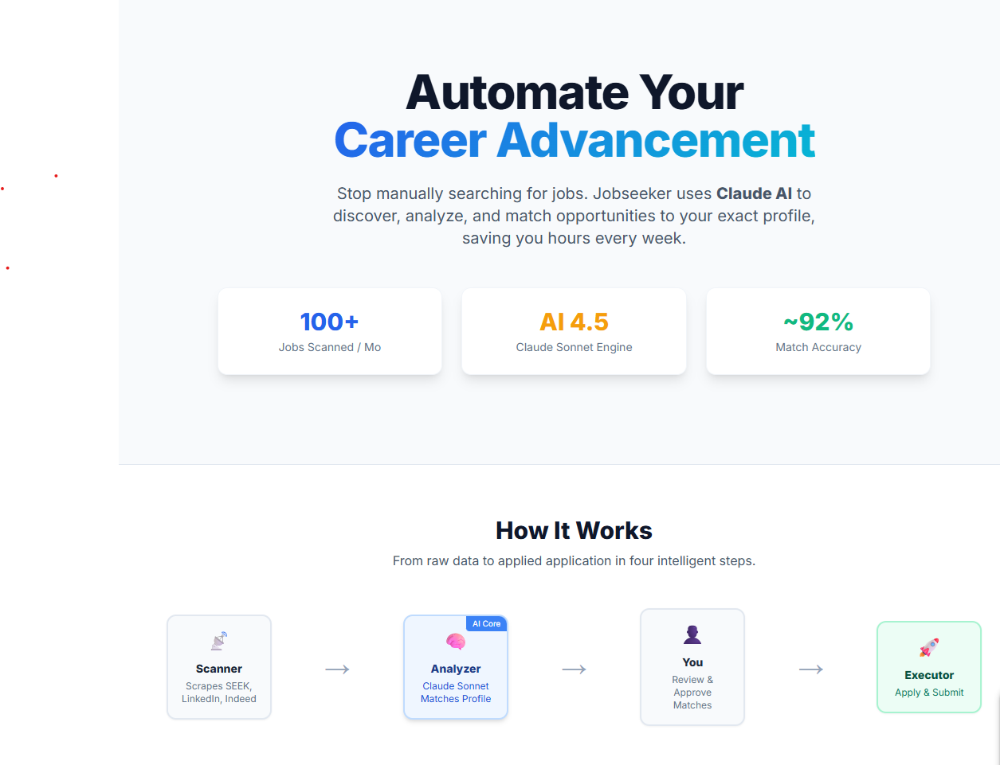
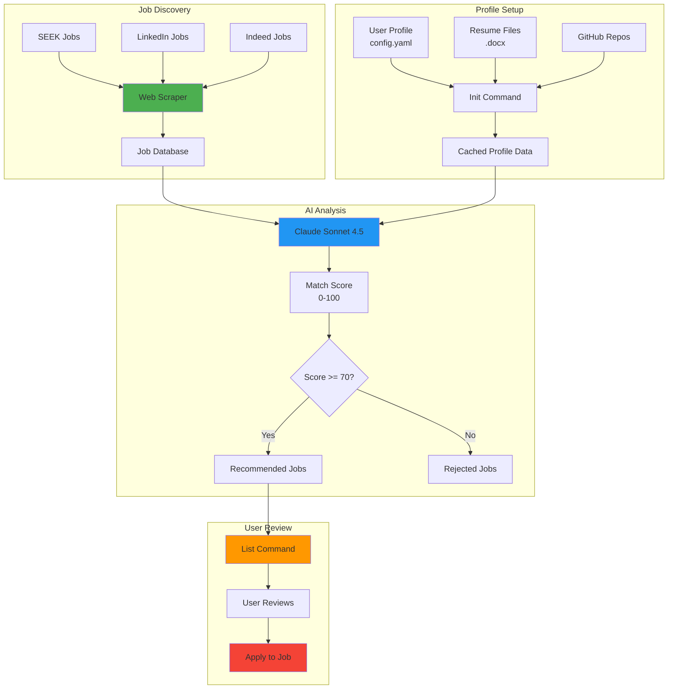
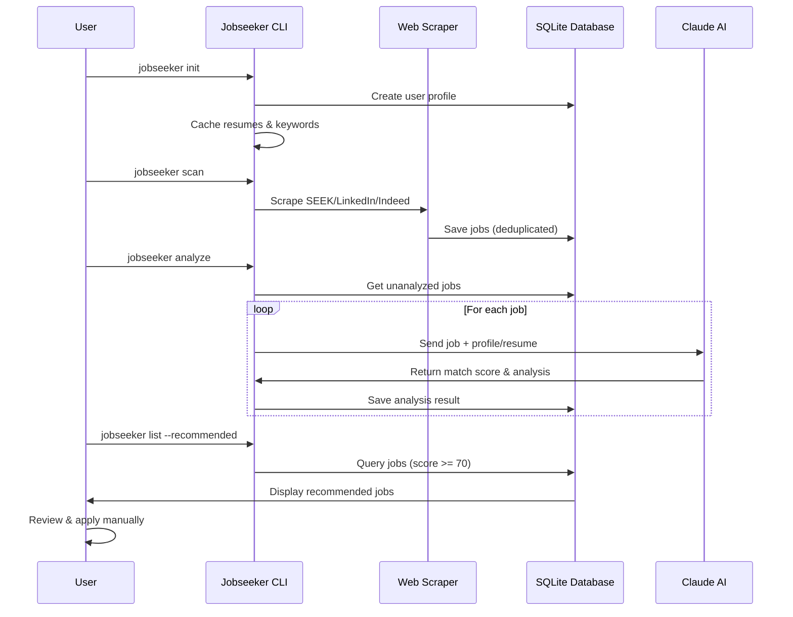
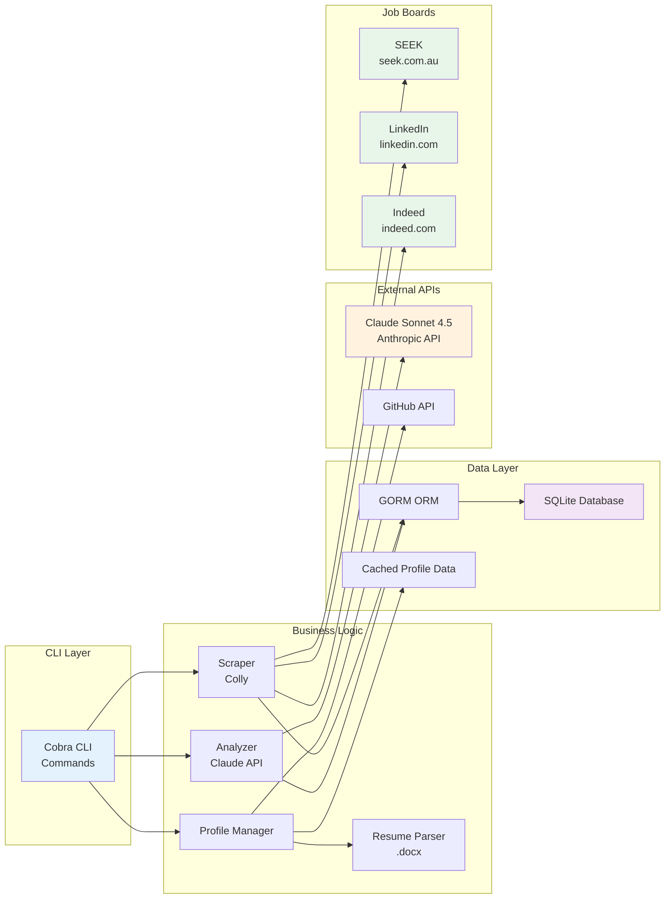

# Jobseeker - AI-Powered Job Application Assistant

An intelligent job search automation tool that discovers jobs, analyzes matches using Claude AI, and helps you apply to the best opportunities.





## Features

- **Multi-User Support**: Designed for multiple users with isolated data and profiles
- **Automated Scraping**: Discovers jobs from SEEK, LinkedIn, and Indeed
- **AI-Powered Matching**: Uses Claude Sonnet 4.5 to analyze job fit based on your profile
- **Resume Integration**: Uses actual resume content for better matching
- **Smart Filtering**: Only surfaces jobs above your match threshold
- **Profile Caching**: Caches resumes, GitHub repos, and profile data for efficiency
- **Database Tracking**: SQLite database to track applications and avoid duplicates
- **Extensible**: Easy to add new job boards and customize matching logic
- **SaaS Ready**: Built with subscription plans and usage limits for future public deployment

## How It Works



## Architecture

```
Scanner → Planner → Approval → Executor
   ↓         ↓          ↓         ↓
 SEEK     Claude AI   You      Apply
LinkedIn   Match      Review   Submit
Indeed    Analysis   Approve  Generate
```

## Technical Architecture



## Project Structure

```
jobseeker/
├── cmd/
│   └── jobseeker/          # CLI entry points
│       ├── main.go         # Root command setup
│       ├── init.go         # Profile initialization
│       ├── scan.go         # Scraper command
│       ├── analyze.go      # AI analysis command
│       └── list.go         # View jobs command
├── internal/
│   ├── database/           # Database models & setup
│   │   ├── models.go      # User, Job, Application models
│   │   ├── db.go          # Database initialization
│   │   ├── user.go        # User operations
│   │   └── helpers.go     # Job type detection, stats
│   ├── analyzer/           # Claude AI integration
│   │   └── analyzer.go    # Job matching & analysis
│   ├── profile/            # Profile management
│   │   └── profile.go     # Config loading
│   ├── resume/             # Resume handling
│   │   ├── loader.go      # .docx parsing
│   │   └── keywords.go    # Keyword extraction
│   └── scraper/            # Job board scrapers
│       ├── scraper.go     # SEEK, LinkedIn, Indeed
│       └── *_test.go      # Scraper tests
├── pkg/
│   ├── claude/             # Reusable Claude API client
│   │   └── client.go
│   └── github/             # GitHub API integration
│       └── github.go
├── configs/
│   └── config.yaml         # User profile & preferences
├── resumes/                # User resume files (.docx)
├── .env                    # API keys & settings
└── jobseeker.db            # SQLite database
```

## Setup Instructions

### Prerequisites

1. **Install Go 1.21 or higher**
   - Download from: https://go.dev/dl/
   - Verify: `go version`

2. **Get Claude API Key**
   - Sign up at: https://console.anthropic.com/
   - Create an API key
   - You'll need this for AI job matching

### Installation

1. **Clone the repository**
   ```bash
   cd C:\workspace\jobseeker
   ```

2. **Install dependencies**
   ```bash
   go mod download
   ```

3. **Configure environment**
   ```bash
   # Copy the example file
   copy .env.example .env

   # Edit .env and add:
   # USER_EMAIL=your.email@example.com  (REQUIRED - must match config.yaml)
   # CLAUDE_API_KEY=sk-ant-...
   # GITHUB_USERNAME=yourghusername (optional)
   # LINKEDIN_URL=https://linkedin.com/in/yourprofile (optional)
   ```

4. **Update your profile**
   Edit `configs/config.yaml` with:
   - **Email address** (must match USER_EMAIL in .env)
   - Your name and location
   - Your skills
   - Experience years
   - Salary preferences (permanent + contract rates)
   - Job search URLs

5. **Prepare resumes (optional but recommended)**
   ```bash
   # Create resumes directory
   mkdir resumes

   # Add your resume(s) as .docx files
   # Example naming for best matching:
   #   - Senior_Backend_Resume.docx
   #   - Contract_Developer_Resume.docx
   #   - Permanent_Position_Resume.docx
   ```

6. **Build the application**
   ```bash
   go build -o jobseeker.exe ./cmd/jobseeker
   ```

7. **Initialize your profile**
   ```bash
   # Run init to cache profile data
   jobseeker init

   # Optional: include GitHub repos
   jobseeker init --github yourusername

   # Optional: include LinkedIn
   jobseeker init --linkedin https://linkedin.com/in/yourprofile

   # Force refresh after updating resumes
   jobseeker init --force
   ```

## Multi-User Architecture

Jobseeker is designed to support multiple users with isolated data:

- **User Identification**: Each user is identified by email address
- **Data Isolation**: Jobs, analyses, and applications are scoped to users
- **Profile Caching**: Resumes and profile data are cached per user for efficiency
- **Subscription Ready**: Built-in support for usage limits and subscription plans

### Adding Multiple Users

To support multiple users:

1. Each user has their own `config.yaml` with unique email
2. Set `USER_EMAIL` in .env or environment variable
3. Run `jobseeker init` for each user
4. All commands automatically filter by current user

### Usage Limits

Built-in subscription system (for future SaaS deployment):

| Plan | Jobs/Month | AI Analyses/Month |
|------|------------|-------------------|
| Free | 100 | 50 |
| Premium | TBD | TBD |
| Enterprise | TBD | TBD |

## Command Reference

### `jobseeker init` - Initialize User Profile

Initializes or refreshes user profile and caches data for efficient operation.

**Usage:**
```bash
jobseeker init [flags]
```

**Flags:**
- `--force` - Force refresh even if already initialized
- `--github string` - GitHub username to fetch repositories
- `--linkedin string` - LinkedIn profile URL

**What it does:**
- Creates or updates user in database
- Caches all resumes from `./resumes/` directory
- Extracts keywords from resumes using Claude AI
- Fetches GitHub repositories (if username provided)
- Stores LinkedIn profile URL
- Shows usage statistics

**Examples:**
```bash
# First-time setup
jobseeker init

# Include GitHub repos
jobseeker init --github guidebee

# Include everything
jobseeker init --github guidebee --linkedin https://linkedin.com/in/myprofile

# Refresh after updating resumes
jobseeker init --force

# Output
Initializing user profile...
✓ User: James Shen (james.shen@guidebee.com)

Loading profile data...
✓ Found 2 resume(s)
  - Senior_Backend_Resume.docx
  - Contract_Developer_Resume.docx

Extracting keywords from resume...
✓ Extracted keywords:
  Primary skills: [Go, Rust, React, .Net Core, Angular]
  Roles: [Senior Software Engineer, Backend Developer]

Fetching GitHub repos for: guidebee
✓ Found 15 repositories

✓ Profile data initialized

Profile Summary:
  User: James Shen <james.shen@guidebee.com>
  Location: Melbourne, VIC
  Plan: free
  Resumes: 2 cached
  GitHub: @guidebee

✓ Initialization complete!
Run 'jobseeker scan' to start finding jobs
```

**When to run init:**
- On first use of the application
- After adding or updating resumes
- After changing profile information in config.yaml
- To update GitHub repos or LinkedIn profile

### `jobseeker scan` - Discover Jobs

Scrapes configured job boards and saves jobs to database.

**Usage:**
```bash
jobseeker scan [flags]
```

**Global Flags:**
- `-c, --config string` - Path to config file (default: "configs/config.yaml")
- `-d, --database string` - Path to database file (default: "./jobseeker.db")

**Configuration:**
Edit `configs/config.yaml` to add multiple search URLs:
```yaml
job_boards:
  seek:
    enabled: true
    search_urls:
      - "https://www.seek.com.au/jobs?keywords=golang&location=melbourne"
      - "https://www.seek.com.au/jobs?keywords=go+developer&location=melbourne"
      - "https://www.seek.com.au/contract-jobs?keywords=software+engineer&location=melbourne"
```

**Examples:**
```bash
# Scan all configured URLs
jobseeker scan

# Use custom config
jobseeker scan --config myprofile.yaml

# Output
Scanning SEEK...
Configured 3 search URLs

[1/3] Scanning: https://www.seek.com.au/jobs?keywords=golang...
  Found 22 jobs
[2/3] Scanning: https://www.seek.com.au/jobs?keywords=go+developer...
  Found 18 jobs
[3/3] Scanning: https://www.seek.com.au/contract-jobs...
  Found 15 jobs

✓ Scan complete! Found 55 total jobs
```

---

### `jobseeker analyze` - AI Job Matching

Uses Claude AI to analyze jobs and provide match scores.

**Usage:**
```bash
jobseeker analyze [flags]
```

**Flags:**
- `--contract` - Analyze only contract roles
- `-t, --type string` - Analyze only specific job type (contract, permanent, unknown)

**Resume Support:**
The analyzer automatically uses resume(s) from `./resumes/` directory if available, otherwise falls back to `config.yaml`.

**Examples:**
```bash
# Analyze all unanalyzed jobs (uses resumes if available)
jobseeker analyze

# Analyze only contract roles
jobseeker analyze --contract

# Analyze only permanent roles
jobseeker analyze --type permanent

# Output with resumes
✓ Using resume(s) for analysis
Loaded 2 resume(s) from ./resumes
  - SeniorDeveloper.docx
  - Contract_Resume.docx

Analyzing jobs with Claude AI...
Filtering for contract roles only...
Found 15 jobs to analyze

[1/15] Analyzing: Contract Software Engineer at Tech Co (contract)
  ✓ Match: 92/100 - RECOMMENDED
[2/15] Analyzing: Senior Go Developer at Startup (contract)
  ○ Match: 65/100 - Below threshold

✓ Analysis complete!
  Recommended jobs: 8
  Below threshold: 7
```

---

### `jobseeker list` - View Jobs

Display jobs from database with filtering options.

**Usage:**
```bash
jobseeker list [flags]
```

**Flags:**
- `-s, --status string` - Filter by status (discovered, recommended, applied, rejected)
- `-t, --type string` - Filter by job type (contract, permanent, unknown)
- `-r, --recommended` - Show only recommended jobs
- `--contract` - Show only contract roles
- `-l, --limit int` - Maximum number of jobs to show (default: 10)

**Examples:**
```bash
# Show recommended jobs
jobseeker list --recommended

# Show only contract roles
jobseeker list --contract

# Show recommended contract jobs
jobseeker list --recommended --contract

# Show first 20 jobs
jobseeker list --limit 20

# Filter by status
jobseeker list --status discovered --limit 5

# Filter by type
jobseeker list --type permanent --recommended

# Output
Found 8 jobs:

1. Senior Go Developer
   Company: Tech Co | Location: Melbourne | Type: permanent
   Rate/Salary: $140,000 - $160,000 per year
   Status: recommended | Match Score: 92/100
   URL: https://www.seek.com.au/job/12345

2. Contract Software Engineer
   Company: Startup Inc | Location: Remote | Type: contract
   Rate/Salary: $900 per day
   Status: recommended | Match Score: 88/100
   URL: https://www.seek.com.au/job/67890

Total: 8 jobs
```

---

## Complete Workflows

### Workflow 1: Basic Job Search
```bash
# 1. Scan for jobs
jobseeker scan

# 2. Analyze all jobs (uses resume if available)
jobseeker analyze

# 3. View recommendations
jobseeker list --recommended
```

### Workflow 2: Contract-Only Search
```bash
# 1. Scan (including contract-specific URLs)
jobseeker scan

# 2. Analyze only contract roles
jobseeker analyze --contract

# 3. View recommended contracts
jobseeker list --contract --recommended
```

### Workflow 3: Permanent Roles Only
```bash
# 1. Scan all jobs
jobseeker scan

# 2. Analyze only permanent roles
jobseeker analyze --type permanent

# 3. View permanent recommendations
jobseeker list --type permanent --recommended
```

### Workflow 4: Resume-Based Matching
```bash
# 1. Add your resume to resumes/ directory
mkdir resumes
# Copy your resume.docx to resumes/

# 2. Scan for jobs
jobseeker scan

# 3. Analyze with resume (automatic)
jobseeker analyze
# Output: ✓ Using resume(s) for analysis

# 4. See results
jobseeker list --recommended --limit 5
```

## Configuration

### Environment Variables (.env)
```bash
# Required: Your Claude API key from https://console.anthropic.com/
CLAUDE_API_KEY=your_api_key_here

# Optional: Model to use (default: claude-sonnet-4-5-20250929)
CLAUDE_MODEL=claude-sonnet-4-5-20250929

# Optional: Database file path (default: ./jobseeker.db)
DB_PATH=./jobseeker.db

# Optional: Delay between scraper requests in milliseconds (default: 2000)
# Higher values are more polite to websites, lower = faster scraping
SCRAPER_DELAY_MS=2000

# Optional: Minimum match score for recommendations (default: 70)
# Jobs scoring below this will be marked as rejected
MATCH_THRESHOLD=70
```

### Profile Configuration (configs/config.yaml)

**Structure:**
```yaml
profile:
  name: "Your Name"
  email: "your.email@example.com"
  skills:
    - Go
    - Python
    - Docker

  experience:
    total_years: 10
    backend_years: 8
    frontend_years: 3

  preferences:
    job_types:
      - "Full-time"
      - "Contract"

    # Permanent role preferences
    salary_min: 120000  # Annual salary in AUD

    # Contract role preferences
    contract:
      hourly_rate_min: 80   # AUD per hour
      daily_rate_min: 650   # AUD per day

    locations:
      - "Melbourne"
      - "Remote"

# Multiple search URLs per job board
job_boards:
  seek:
    enabled: true
    search_urls:
      - "https://www.seek.com.au/jobs?keywords=golang&location=melbourne"
      - "https://www.seek.com.au/jobs?keywords=rust&location=melbourne"
      - "https://www.seek.com.au/contract-jobs?keywords=backend+developer"
```

**Key Features:**
- **Multiple search URLs**: Scraper processes all URLs in the list
- **Separate salary preferences**: Different minimums for permanent vs contract
- **Contract rate detection**: Automatically identifies contract roles by keywords
- **Skills matching**: Used by AI for job evaluation

### Resume Setup (Optional but Recommended)

For significantly better matching, add your actual resume(s):

**1. Create resumes directory:**
```bash
mkdir resumes
```

**2. Add Word documents (.docx):**
- ✓ Copy your resume files to `resumes/`
- ✓ Supports multiple resumes for different roles
- ✓ Auto-selects best resume per job

**3. Resume naming strategies:**
```
resumes/
  ├── General_Resume.docx           # Default fallback
  ├── Contract_Resume.docx          # Used for contract roles
  ├── Senior_Backend_Resume.docx    # Keyword matching
  └── Permanent_FullStack.docx      # Specific role type
```

**4. How selection works:**
- **Contract jobs** → Looks for "contract" in filename
- **Permanent jobs** → Looks for "permanent" in filename
- **Keyword matching** → Matches role terms (senior, backend, etc.)
- **Default** → Uses first resume if no specific match

**5. Benefits:**
- Claude sees your full work history, projects, and achievements
- More accurate skill matching from actual experience
- Better recommendations based on real qualifications
- Can be used later for cover letter generation

**6. Fallback:**
If no resumes found, analyzer automatically uses `config.yaml` profile.

**Example output:**
```bash
$ jobseeker analyze
✓ Using resume(s) for analysis
Loaded 3 resume(s) from ./resumes
  - General_Resume.docx
  - Contract_Resume.docx
  - Senior_Backend_Resume.docx

Analyzing jobs with Claude AI...
[1/22] Analyzing: Senior Backend Developer (permanent)
  Selected resume: Senior_Backend_Resume.docx
  ✓ Match: 94/100 - RECOMMENDED
```

## Go Learning Guide

This project is designed to teach you Go through practical examples:

### Key Go Concepts You'll Learn

1. **Project Structure**
   - `cmd/`: Executable commands (main packages)
   - `internal/`: Private application code (can't be imported by other projects)
   - `pkg/`: Reusable library code (can be imported)

2. **Error Handling**
   ```go
   result, err := someFunction()
   if err != nil {
       return fmt.Errorf("context: %w", err)  // Wrap errors with context
   }
   ```

3. **Interfaces** (see `internal/scraper/scraper.go`)
   - Abstraction for different job board scrapers
   - Makes code testable and extensible

4. **Structs and Methods** (see `pkg/claude/client.go`)
   - Organizing data and behavior
   - Pointer receivers vs value receivers

5. **Goroutines and Concurrency** (see `internal/scraper/scraper.go`)
   - `colly.Async(true)` enables concurrent scraping
   - Channels for communication between goroutines

6. **Database with GORM** (see `internal/database/`)
   - ORM patterns in Go
   - Automatic migrations
   - Querying and relationships

### Next Steps for Learning

1. **Add a new scraper**
   - Create `ScrapeLinkedIn()` method
   - Learn HTML parsing with colly

2. **Add tests**
   ```bash
   # Create analyzer_test.go
   go test ./internal/analyzer
   ```

3. **Add a web dashboard**
   - Use `gin` or `fiber` framework
   - Serve job listings via HTTP

4. **Implement application submission**
   - Add `executor` package
   - Generate cover letters with Claude
   - Automate form submission

## Development Tips

### Running Without Building
```bash
go run ./cmd/jobseeker scan
```

### Hot Reload During Development
```bash
# Install air for hot reload
go install github.com/air-verse/air@latest

# Run with auto-reload
air
```

### Debugging
Add print statements:
```go
log.Printf("Debug: job = %+v\n", job)
```

### Testing
```bash
# Run all tests
go test ./...

# Test specific package
go test ./internal/analyzer -v

# Run with coverage
go test -cover ./...
```

## Common Issues

### "Module not found"
```bash
go mod tidy
go mod download
```

### Scraper not finding jobs

**SEEK**:
- Inspect SEEK's HTML structure (it changes frequently)
- Update selectors in `internal/scraper/scraper.go`
- Use browser DevTools to find correct CSS selectors

**LinkedIn**:
- LinkedIn uses heavy JavaScript rendering, so the scraper may find 0 jobs even when jobs exist
- The scraper only gets the initial HTML without executing JavaScript
- This is a known limitation of static HTML scraping
- For reliable job discovery, focus on SEEK as the primary source
- To improve LinkedIn scraping, consider:
  - Using a headless browser library (chromedp, selenium)
  - Switching to LinkedIn's official API (requires partnership)
  - Using LinkedIn as a secondary, supplementary source

**Indeed**:
- Indeed actively blocks scrapers with 403 errors if requests don't look like a real browser
- The scraper now includes proper Referer and Origin headers to bypass this
- Uses multiple selector strategies to handle different page layouts
- More reliable than LinkedIn, but still may be blocked with high request volumes
- If you get 403 errors or 0 jobs:
  - Increase SCRAPER_DELAY_MS in .env (try 3000-5000ms)
  - The scraper already sets proper User-Agent, Referer, and Origin headers
  - Consider using proxies for high-volume scraping

### Claude API errors
- Check API key is set: `echo %CLAUDE_API_KEY%`
- Verify key is valid in Anthropic console
- Check rate limits (Tier 1: 50 requests/min)

## Quick Reference Card

### Commands at a Glance

| Command | Purpose | Key Flags |
|---------|---------|-----------|
| `jobseeker scan` | Discover jobs from configured URLs | `--config`, `--database` |
| `jobseeker analyze` | AI job matching with Claude | `--contract`, `--type` |
| `jobseeker list` | View jobs from database | `--recommended`, `--contract`, `--type`, `--limit` |

### Common Command Combinations

```bash
# Daily job search routine
jobseeker scan && jobseeker analyze && jobseeker list --recommended

# Contract-focused search
jobseeker scan && jobseeker analyze --contract && jobseeker list --contract --recommended

# Quick status check
jobseeker list --recommended --limit 5

# See all new jobs (not yet analyzed)
jobseeker list --status discovered --limit 20

# Re-analyze with updated resume
jobseeker analyze  # Automatically detects resumes in ./resumes/
```

### File Locations

| File/Directory | Purpose |
|----------------|---------|
| `configs/config.yaml` | Your profile, skills, salary preferences, search URLs |
| `.env` | Claude API key and environment settings |
| `resumes/*.docx` | Your resume(s) for better AI matching |
| `jobseeker.db` | SQLite database with all jobs and analysis |
| `internal/scraper/scraper_test.go` | Scraper debugging tests |

### Environment Variables Quick Guide

| Variable | Required | Default | Purpose |
|----------|----------|---------|---------|
| `CLAUDE_API_KEY` | ✓ Yes | - | Your Anthropic API key |
| `CLAUDE_MODEL` | No | sonnet-4.5 | AI model to use |
| `DB_PATH` | No | `./jobseeker.db` | Database location |
| `SCRAPER_DELAY_MS` | No | `2000` | Delay between requests |
| `MATCH_THRESHOLD` | No | `70` | Minimum score for recommendations |

## Roadmap

- [x] LinkedIn scraper
- [x] Indeed scraper
- [ ] Web dashboard for job review
- [ ] Cover letter generation
- [ ] Automated application submission
- [ ] Email monitoring for recruiter responses
- [ ] Resume tailoring per job
- [ ] Interview scheduling

## Contributing

This is a learning project! Feel free to:
- Add new job boards
- Improve matching algorithms
- Add tests
- Create new features

## License

MIT - Build whatever you want!

## Resources

- [Go Documentation](https://go.dev/doc/)
- [Go by Example](https://gobyexample.com/)
- [Effective Go](https://go.dev/doc/effective_go)
- [Colly Scraping Tutorial](http://go-colly.org/docs/)
- [GORM Documentation](https://gorm.io/docs/)
- [Cobra CLI Guide](https://github.com/spf13/cobra)
- [Claude API Docs](https://docs.anthropic.com/)
