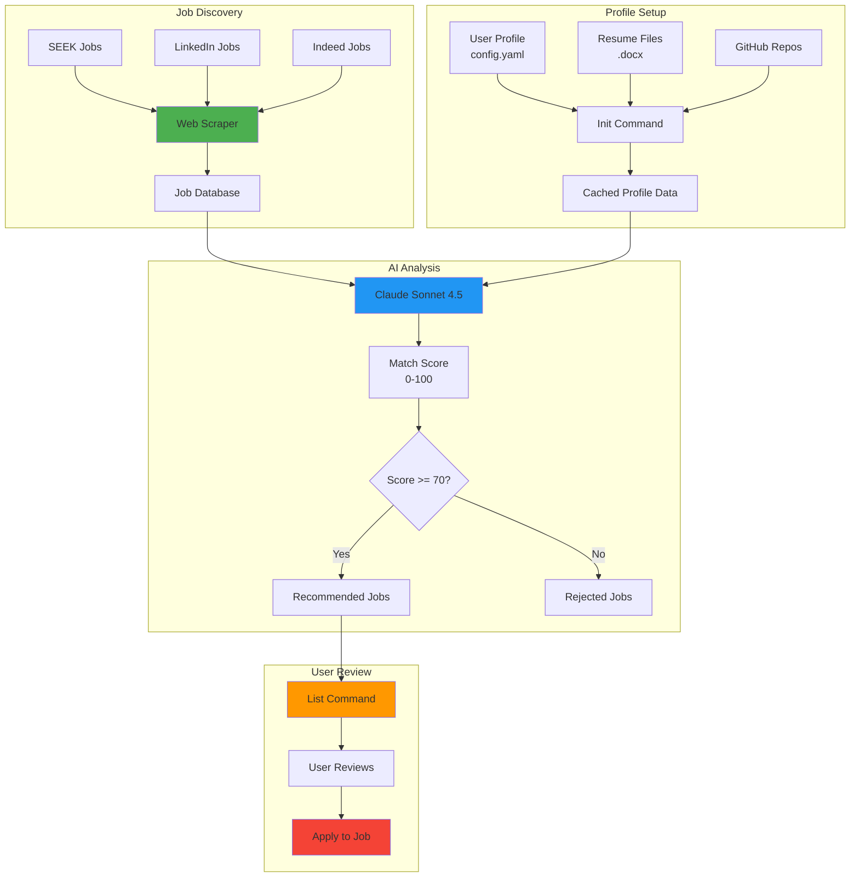
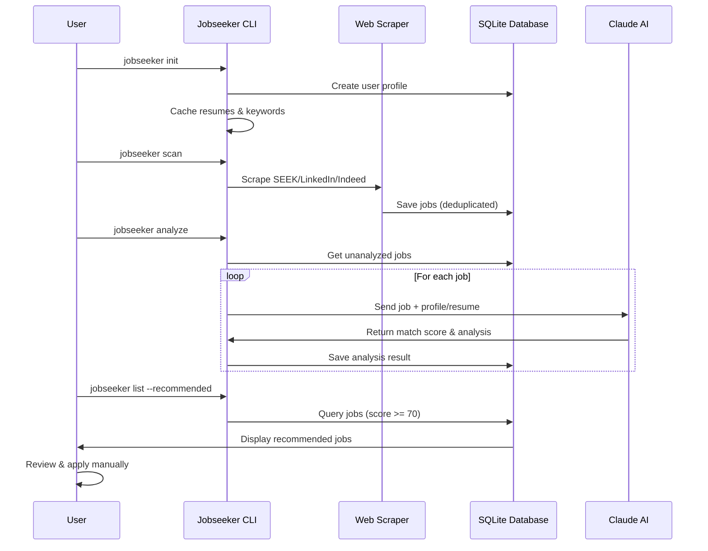
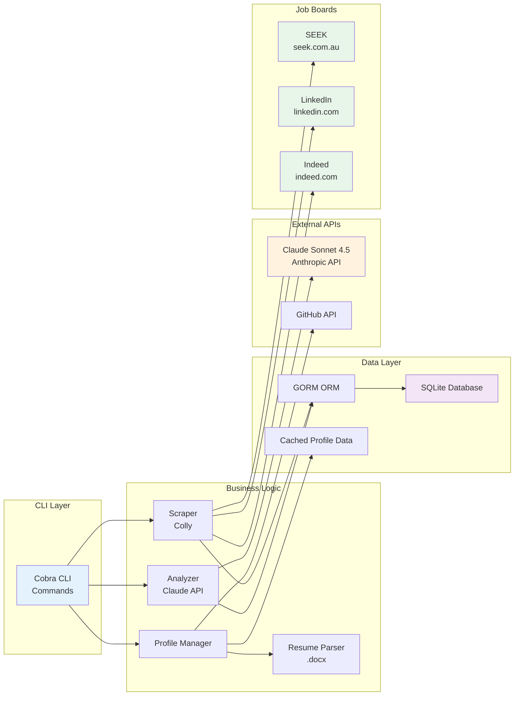

# Jobseeker - AI-Powered Job Application Assistant

An intelligent job search automation tool that discovers jobs, analyzes matches using Claude AI, and helps you apply to the best opportunities.




## ⚠️ Disclaimer

**IMPORTANT: Please read before using this application**

- **Personal Use Only**: This repository is intended for personal, educational, and non-commercial use only.
- **Web Scraping Compliance**: When scraping job boards (SEEK, LinkedIn, Indeed), you must abide by each website's Terms of Service, robots.txt, and acceptable use policies. It is your responsibility to ensure compliance with these policies.
- **No Liability**: The author(s) of this repository accept no responsibility or liability for any disputes, issues, or consequences arising from the use of this software, including but not limited to violations of website policies, legal issues, or data misuse.
- **Trial Implementation**: Only the **scan** and **analyze** components have been fully implemented and tested as a trial project using Claude Code. Other features mentioned in the roadmap are planned but not yet developed.
- **Use at Your Own Risk**: By using this software, you acknowledge that you do so entirely at your own risk and agree to comply with all applicable laws and regulations.

**Recommendation**: Always check the Terms of Service and robots.txt files of websites before scraping. Consider using official APIs where available.

## Features

- **Multi-User Support**: Designed for multiple users with isolated data and profiles
- **Automated Scraping**: Discovers jobs from SEEK, LinkedIn, and Indeed
- **AI-Powered Matching**: Uses Claude Sonnet 4.5 to analyze job fit based on your profile
- **Resume Integration**: Uses actual resume content for better matching
- **Recruiter JD Analysis**: Analyze Word docs from recruiters with detailed skill matching
- **Cover Letter Generation**: AI-generated cover letters with iterative refinement
- **Tailored CV Generation**: Auto-generate professionally formatted CVs in Word format using Claude's document skills
- **Excel Export** (NEW): Export job search data to professional Excel spreadsheets with charts and analysis
- **Smart Filtering**: Only surfaces jobs above your match threshold
- **Profile Caching**: Caches resumes, GitHub repos, and profile data for efficiency
- **Database Tracking**: SQLite database to track applications and avoid duplicates
- **Extensible**: Easy to add new job boards and customize matching logic
- **SaaS Ready**: Built with subscription plans and usage limits for future public deployment

## Real-World Example: James Shen's Job Search in Melbourne

This project is actively being used by James Shen to find roles in Melbourne focusing on React Frontend, FullStack, DevOps, FinTech, and Data Science positions. Below are real job listings discovered and analyzed by the system:

| Title | Company | Salary | Source | Score | Status | Pros | Cons | URL |
|-------|---------|--------|--------|-------|--------|------|------|-----|
| Computer Vision Scientist | Amazon | $180,000 - $220,000 per year | seek | 72 | recommended | ✓ Strong ML/AI background match<br>✓ Backend experience with Python/Go applicable<br>✓ Cloud infrastructure skills relevant | ✗ Less frontend experience than ideal<br>✗ Limited computer vision specialization | [View Job](https://www.seek.com.au/job/81585471) |
| Data Scientist (LLM) | Binance | Not specified | seek | 78 | recommended | ✓ Excellent AI/ML expertise match<br>✓ Strong programming skills (Python, Go)<br>✓ Data engineering background relevant | ✗ Cryptocurrency domain new area<br>✗ Less emphasis on traditional backend | [View Job](https://www.seek.com.au/job/81553656) |
| Director, Data Governance | AUSTRAC | $163,323 - $182,568 per year | seek | 72 | recommended | ✓ Senior leadership experience<br>✓ Technical architecture background<br>✓ Government sector stability | ✗ More governance/management than hands-on coding<br>✗ Less emphasis on modern frameworks | [View Job](https://www.seek.com.au/job/81588234) |
| Web Architect/Developer | Binance | Not specified | seek | 72 | recommended | ✓ Strong fullstack expertise (React, Node.js)<br>✓ Architecture and system design skills<br>✓ Performance optimization experience | ✗ Cryptocurrency industry unfamiliar<br>✗ Less emphasis on backend microservices | [View Job](https://www.seek.com.au/job/81567933) |
| Senior Site Reliability Engineer | Binance | Not specified | seek | 72 | recommended | ✓ Strong DevOps/infrastructure background<br>✓ Kubernetes & cloud experience<br>✓ Backend development skills relevant | ✗ SRE less aligned with primary fullstack focus<br>✗ On-call responsibilities intensive | [View Job](https://www.seek.com.au/job/81567934) |

**About the Search:**
- **Location**: Melbourne, VIC (Remote and Hybrid options included)
- **Target Roles**: React Frontend, FullStack Developer, DevOps Engineer, FinTech, Data Science
- **Match Threshold**: 70+ (recommended jobs shown above)
- **Total Jobs Found**: 19 recommended positions exported to `james.xlsx`
- **Analysis Method**: Claude Sonnet 4.5 analyzing job descriptions against resume and profile

**Key Findings:**
- Strong matches in Data Science and AI/ML roles (78% match for LLM Data Scientist role)
- Multiple opportunities at leading tech companies (Amazon, Binance, AUSTRAC)
- Salary ranges from $160K-$220K+ annually for senior positions
- Diverse role types: Computer Vision, Data Science, Web Architecture, DevOps/SRE

**Next Steps:**
- Generate tailored CVs using `jobseeker tailorcv` for high-match positions
- Create cover letters with `jobseeker checkjd` for recruiter-provided JDs
- Track applications and export results with `jobseeker export`

*This demonstrates real job search automation in action - from scanning to AI analysis to actionable recommendations.*

---

## How It Works



## Architecture

```
Scanner → Planner → Approval → Executor
   ↓         ↓          ↓         ↓
 SEEK     Claude AI   You      Apply
LinkedIn   Match      Review   Submit
Indeed    Analysis   Approve  Generate
```

## Technical Architecture



## Project Structure

```
jobseeker/
├── cmd/
│   └── jobseeker/          # CLI entry points
│       ├── main.go         # Root command setup
│       ├── init.go         # Profile initialization
│       ├── scan.go         # Scraper command
│       ├── analyze.go      # AI analysis command
│       ├── list.go         # View jobs command
│       └── checkjd.go      # Analyze recruiter JDs & generate cover letters
├── internal/
│   ├── database/           # Database models & setup
│   │   ├── models.go      # User, Job, Application models
│   │   ├── db.go          # Database initialization
│   │   ├── user.go        # User operations
│   │   └── helpers.go     # Job type detection, stats
│   ├── analyzer/           # Claude AI integration
│   │   └── analyzer.go    # Job matching & analysis
│   ├── jd/                 # Job description analysis (NEW)
│   │   ├── loader.go      # Load .docx JDs from recruiters
│   │   └── analyzer.go    # Analyze JDs & generate cover letters
│   ├── profile/            # Profile management
│   │   └── profile.go     # Config loading
│   ├── resume/             # Resume handling
│   │   ├── loader.go      # .docx parsing
│   │   └── keywords.go    # Keyword extraction
│   └── scraper/            # Job board scrapers
│       ├── scraper.go     # SEEK, LinkedIn, Indeed
│       └── *_test.go      # Scraper tests
├── pkg/
│   ├── claude/             # Reusable Claude API client
│   │   └── client.go
│   └── github/             # GitHub API integration
│       └── github.go
├── configs/
│   └── config.yaml         # User profile & preferences
├── resumes/                # User resume files (.docx)
├── jobdescriptions/        # Recruiter JDs (.docx) (NEW)
│   ├── archive/           # Processed JDs moved here
│   └── README.md
├── coverletters/           # Generated cover letters (NEW)
├── .env                    # API keys & settings
└── jobseeker.db            # SQLite database
```

## Setup Instructions

### Prerequisites

1. **Install Go 1.21 or higher**
   - Download from: https://go.dev/dl/
   - Verify: `go version`

2. **Get Claude API Key**
   - Sign up at: https://console.anthropic.com/
   - Create an API key
   - You'll need this for AI job matching

### Installation

1. **Clone the repository**
   ```bash
   cd C:\workspace\jobseeker
   ```

2. **Install dependencies**
   ```bash
   go mod download
   ```

3. **Configure environment**
   ```bash
   # Copy the example file
   copy .env.example .env

   # Edit .env and add:
   # USER_EMAIL=your.email@example.com  (REQUIRED - must match config.yaml)
   # CLAUDE_API_KEY=sk-ant-...
   # GITHUB_USERNAME=yourghusername (optional)
   # LINKEDIN_URL=https://linkedin.com/in/yourprofile (optional)
   ```

4. **Update your profile**
   Edit `configs/config.yaml` with:
   - **Email address** (must match USER_EMAIL in .env)
   - Your name and location
   - Your skills
   - Experience years
   - Salary preferences (permanent + contract rates)
   - Job search URLs

5. **Prepare resumes (optional but recommended)**
   ```bash
   # Create resumes directory
   mkdir resumes

   # Add your resume(s) as .docx files
   # Example naming for best matching:
   #   - Senior_Backend_Resume.docx
   #   - Contract_Developer_Resume.docx
   #   - Permanent_Position_Resume.docx
   ```

6. **Build the application**
   ```bash
   go build -o jobseeker.exe ./cmd/jobseeker
   ```

7. **Initialize your profile**
   ```bash
   # Run init to cache profile data
   jobseeker init

   # Optional: include GitHub repos
   jobseeker init --github yourusername

   # Optional: include LinkedIn
   jobseeker init --linkedin https://linkedin.com/in/yourprofile

   # Force refresh after updating resumes
   jobseeker init --force
   ```

## Multi-User Architecture

Jobseeker is designed to support multiple users with isolated data:

- **User Identification**: Each user is identified by email address
- **Data Isolation**: Jobs, analyses, and applications are scoped to users
- **Profile Caching**: Resumes and profile data are cached per user for efficiency
- **Subscription Ready**: Built-in support for usage limits and subscription plans

### Adding Multiple Users

To support multiple users:

1. Each user has their own `config.yaml` with unique email
2. Set `USER_EMAIL` in .env or environment variable
3. Run `jobseeker init` for each user
4. All commands automatically filter by current user

### Usage Limits

Built-in subscription system (for future SaaS deployment):

| Plan | Jobs/Month | AI Analyses/Month |
|------|------------|-------------------|
| Free | 100 | 50 |
| Premium | TBD | TBD |
| Enterprise | TBD | TBD |

## Command Reference

### `jobseeker init` - Initialize User Profile

Initializes or refreshes user profile and caches data for efficient operation.

**Usage:**
```bash
jobseeker init [flags]
```

**Flags:**
- `--force` - Force refresh even if already initialized
- `--github string` - GitHub username to fetch repositories
- `--linkedin string` - LinkedIn profile URL

**What it does:**
- Creates or updates user in database
- Caches all resumes from `./resumes/` directory
- Extracts keywords from resumes using Claude AI
- Fetches GitHub repositories (if username provided)
- Stores LinkedIn profile URL
- Shows usage statistics

**Examples:**
```bash
# First-time setup
jobseeker init

# Include GitHub repos
jobseeker init --github guidebee

# Include everything
jobseeker init --github guidebee --linkedin https://linkedin.com/in/myprofile

# Refresh after updating resumes
jobseeker init --force

# Output
Initializing user profile...
✓ User: James Shen (james.shen@guidebee.com)

Loading profile data...
✓ Found 2 resume(s)
  - Senior_Backend_Resume.docx
  - Contract_Developer_Resume.docx

Extracting keywords from resume...
✓ Extracted keywords:
  Primary skills: [Go, Rust, React, .Net Core, Angular]
  Roles: [Senior Software Engineer, Backend Developer]

Fetching GitHub repos for: guidebee
✓ Found 15 repositories

✓ Profile data initialized

Profile Summary:
  User: James Shen <james.shen@guidebee.com>
  Location: Melbourne, VIC
  Plan: free
  Resumes: 2 cached
  GitHub: @guidebee

✓ Initialization complete!
Run 'jobseeker scan' to start finding jobs
```

**When to run init:**
- On first use of the application
- After adding or updating resumes
- After changing profile information in config.yaml
- To update GitHub repos or LinkedIn profile

### `jobseeker scan` - Discover Jobs

Scrapes configured job boards and saves jobs to database.

**Usage:**
```bash
jobseeker scan [flags]
```

**Global Flags:**
- `-c, --config string` - Path to config file (default: "configs/config.yaml")
- `-d, --database string` - Path to database file (default: "./jobseeker.db")

**Configuration:**
Edit `configs/config.yaml` to add multiple search URLs:
```yaml
job_boards:
  seek:
    enabled: true
    search_urls:
      - "https://www.seek.com.au/jobs?keywords=golang&location=melbourne"
      - "https://www.seek.com.au/jobs?keywords=go+developer&location=melbourne"
      - "https://www.seek.com.au/contract-jobs?keywords=software+engineer&location=melbourne"
```

**Examples:**
```bash
# Scan all configured URLs
jobseeker scan

# Use custom config
jobseeker scan --config myprofile.yaml

# Output
Scanning SEEK...
Configured 3 search URLs

[1/3] Scanning: https://www.seek.com.au/jobs?keywords=golang...
  Found 22 jobs
[2/3] Scanning: https://www.seek.com.au/jobs?keywords=go+developer...
  Found 18 jobs
[3/3] Scanning: https://www.seek.com.au/contract-jobs...
  Found 15 jobs

✓ Scan complete! Found 55 total jobs
```

---

### `jobseeker analyze` - AI Job Matching

Uses Claude AI to analyze jobs and provide match scores.

**Usage:**
```bash
jobseeker analyze [flags]
```

**Flags:**
- `--contract` - Analyze only contract roles
- `-t, --type string` - Analyze only specific job type (contract, permanent, unknown)

**Resume Support:**
The analyzer automatically uses resume(s) from `./resumes/` directory if available, otherwise falls back to `config.yaml`.

**Examples:**
```bash
# Analyze all unanalyzed jobs (uses resumes if available)
jobseeker analyze

# Analyze only contract roles
jobseeker analyze --contract

# Analyze only permanent roles
jobseeker analyze --type permanent

# Output with resumes
✓ Using resume(s) for analysis
Loaded 2 resume(s) from ./resumes
  - SeniorDeveloper.docx
  - Contract_Resume.docx

Analyzing jobs with Claude AI...
Filtering for contract roles only...
Found 15 jobs to analyze

[1/15] Analyzing: Contract Software Engineer at Tech Co (contract)
  ✓ Match: 92/100 - RECOMMENDED
[2/15] Analyzing: Senior Go Developer at Startup (contract)
  ○ Match: 65/100 - Below threshold

✓ Analysis complete!
  Recommended jobs: 8
  Below threshold: 7
```

---

### `jobseeker list` - View Jobs

Display jobs from database with filtering options.

**Usage:**
```bash
jobseeker list [flags]
```

**Flags:**
- `-s, --status string` - Filter by status (discovered, recommended, applied, rejected)
- `-t, --type string` - Filter by job type (contract, permanent, unknown)
- `-r, --recommended` - Show only recommended jobs
- `--contract` - Show only contract roles
- `-l, --limit int` - Maximum number of jobs to show (default: 10)

**Examples:**
```bash
# Show recommended jobs
jobseeker list --recommended

# Show only contract roles
jobseeker list --contract

# Show recommended contract jobs
jobseeker list --recommended --contract

# Show first 20 jobs
jobseeker list --limit 20

# Filter by status
jobseeker list --status discovered --limit 5

# Filter by type
jobseeker list --type permanent --recommended

# Output
Found 8 jobs:

1. Senior Go Developer
   Company: Tech Co | Location: Melbourne | Type: permanent
   Rate/Salary: $140,000 - $160,000 per year
   Status: recommended | Match Score: 92/100
   URL: https://www.seek.com.au/job/12345

2. Contract Software Engineer
   Company: Startup Inc | Location: Remote | Type: contract
   Rate/Salary: $900 per day
   Status: recommended | Match Score: 88/100
   URL: https://www.seek.com.au/job/67890

Total: 8 jobs
```

---

### `jobseeker checkjd` - Analyze Recruiter Job Descriptions

Analyzes job descriptions received directly from recruiters (typically via email as Word documents) and generates tailored cover letters with iterative refinement.

**Key Features:**
- Analyzes local .docx files from `jobdescriptions/` directory
- Detailed skill matching against your profile and resumes
- **Iterative cover letter refinement** - refine with feedback until satisfied
- Automatic archiving of processed JDs
- No salary/location required - focuses on skill match

**Usage:**
```bash
jobseeker checkjd [flags]
```

**Flags:**
- `--jd-dir string` - Directory containing job description .docx files (default: `jobdescriptions`)
- `--archive-dir string` - Directory to move processed JDs (default: `jobdescriptions/archive`)
- `--cover-dir string` - Directory to save generated cover letters (default: `coverletters`)

#### Quick Start

**1. Setup - Place JD files in directory:**
```bash
# Create directory structure
mkdir -p jobdescriptions coverletters

# Add your JD files
jobdescriptions/
├── Senior_Backend_Developer_TechCorp.docx
├── Lead_Engineer_StartupXYZ.docx
└── README.md
```

**2. Run analysis:**
```bash
jobseeker checkjd
```

**3. Interactive workflow - for each JD:**
- ✓ Analyzes skill match and fit
- ✓ Shows match score, pros/cons, matched skills
- ✓ Optionally generates cover letter
- ✓ **Iterative refinement loop** - refine until satisfied
- ✓ Archives processed JD

#### Example Session

```
$ jobseeker checkjd

Found 2 job description(s) to process

================================================================================
Processing JD 1/2: Senior_Backend_Developer_TechCorp.docx
================================================================================

Analyzing job description with Claude AI...

MATCH SCORE: 87/100

Resume Used: backend_senior_resume.docx

OVERALL ASSESSMENT:
Strong match for backend development role. Your 8 years of Go and microservices
experience aligns well with their requirements. The role focuses on building
scalable APIs, which matches your background.

PROS:
  ✓ Extensive Go and microservices experience
  ✓ Strong background in API development and system design
  ✓ Experience with Docker and Kubernetes matches their infrastructure
  ✓ Previous team leadership aligns with senior-level expectations

CONS:
  ✗ Limited GraphQL experience mentioned in JD
  ✗ No mention of specific AWS services they use

KEY SKILLS MATCHED:
  • Go (Golang)
  • Microservices Architecture
  • Docker & Kubernetes
  • PostgreSQL
  • REST API Design

SKILLS TO DEVELOP:
  • GraphQL
  • AWS Lambda

Would you like to generate a cover letter for this job? (y/n): y

You can provide additional context for the cover letter (optional).
For example: specific projects, achievements, or why you're interested.
You can paste multiple lines of text.

Your context (or press Enter to skip):
(Type END on a new line when done, or paste text and press Ctrl+D/Ctrl+Z)
> I built a microservices platform that handles 50M requests/day with 99.99% uptime.
> The system processes 2000+ req/sec using Go, Kubernetes, and PostgreSQL.
> END

Generating cover letter...

--------------------------------------------------------------------------------
GENERATED COVER LETTER:
--------------------------------------------------------------------------------
Dear Hiring Manager,

I am writing to express my strong interest in the Senior Backend Developer
position at TechCorp. With over 8 years of experience in Go development and
microservices architecture, I am confident I can make immediate contributions
to your engineering team.

In my current role, I built a microservices platform that handles 50 million
requests per day, leveraging Go, Docker, and Kubernetes to ensure scalability
and reliability...

[... rest of cover letter ...]

--------------------------------------------------------------------------------

Options:
  1. Save this cover letter
  2. Refine it (provide feedback for changes)
  3. Discard and skip

Enter your choice (1/2/3): 2

What would you like to change?
Examples: 'Make it more concise', 'Add more technical details',
          'Emphasize leadership experience', 'More enthusiastic tone'
You can paste multiple lines of detailed feedback.

Your feedback:
(Type END on a new line when done, or paste text and press Ctrl+D/Ctrl+Z)
> Make it 30% shorter and add specific API performance metrics
> Also mention the leadership aspect - I mentored 5 junior developers
> END

Refining cover letter based on your feedback...

--------------------------------------------------------------------------------
GENERATED COVER LETTER:
--------------------------------------------------------------------------------
Dear Hiring Manager,

I'm excited to apply for the Senior Backend Developer role at TechCorp. With 8
years specializing in Go microservices, I've built systems handling 50M+ daily
requests with 99.99% uptime and <100ms p95 latency.

My platform serves APIs processing 2000+ requests/second using Go, Kubernetes,
and PostgreSQL. This hands-on experience in distributed systems and
high-performance APIs directly matches your technical requirements...

[... rest of refined cover letter ...]

--------------------------------------------------------------------------------

Options:
  1. Save this cover letter
  2. Refine it (provide feedback for changes)
  3. Discard and skip

Enter your choice (1/2/3): 1
✓ Cover letter saved to: coverletters/Senior_Backend_Developer_TechCorp_coverletter.txt
✓ Archived Senior_Backend_Developer_TechCorp.docx

[Processing continues for next JD...]
```

#### Iterative Cover Letter Refinement

**NEW FEATURE:** Refine cover letters with specific feedback until you're satisfied.

**How it works:**
1. **Generate** - AI creates initial cover letter from your resume + JD
2. **Review** - See the generated letter
3. **Choose** - Save, Refine, or Discard
4. **Iterate** - Provide feedback, regenerate, review again
5. **Repeat** - Until satisfied or decide to discard

**Effective Feedback Examples:**

✅ **Good (Specific):**
- "Make it 30% shorter, keep only key points"
- "Add specific metrics about performance improvements"
- "Emphasize leadership and mentoring experience"
- "Use more enthusiastic tone, less formal"
- "Focus more on microservices architecture skills"
- "Include technologies from the JD: GraphQL, AWS Lambda"

❌ **Vague (Less Effective):**
- "Make it better"
- "I don't like it"
- "Change the tone"

**Common Refinement Patterns:**

1. **Generic → Specific**
   - Feedback: "Add metrics about my platform handling 50M requests/day"
   - Result: Concrete achievements instead of generic statements

2. **Too Long → Concise**
   - Feedback: "Maximum 3 paragraphs, focus on key strengths"
   - Result: Tight, impactful letter

3. **Too Formal → Balanced**
   - Feedback: "More conversational but still professional, like talking to a colleague"
   - Result: Warm yet professional tone

4. **Missing Points → Comprehensive**
   - Feedback: "Also emphasize my team leadership and mentoring 5 junior developers"
   - Result: Balanced technical + leadership showcase

**Refinement Tips:**

- **Be specific** - Say what to change (tone, length, content focus)
- **Paste detailed feedback** - Multi-line input supported! Paste comprehensive feedback from notes or clipboard
- **Iterate gradually** - Don't try to fix everything at once
  1. First pass: Structure/length
  2. Second pass: Content
  3. Third pass: Tone/polish
- **Reference your context** - "Emphasize the project I mentioned about 50M requests"
- **Use examples** - "Make it sound like: 'I've built systems that...' not 'I have experience in...'"

**How to Enter Multi-line Input:**
- Just paste your text (from any source)
- Type `END` on a new line when done
- Or press Ctrl+D (Unix/Mac) or Ctrl+Z then Enter (Windows)
- Press Enter immediately on first line to skip/use empty input

**When to refine vs. accept:**

Accept first draft when:
- Core content is accurate and solid
- Tone and length are appropriate
- Key achievements well highlighted
- Only minor word tweaks needed (can edit manually)

Refine when:
- Wrong tone (too formal/casual/generic)
- Missing key experience points
- Too long or too short
- Doesn't emphasize what matters for this role
- Sounds templated rather than personalized

Discard when:
- After 2-3 refinements, still not right
- Decide job isn't a good fit
- Want to start fresh with different initial context

#### Tips & Best Practices

**File Naming:**
```
✅ Senior_Backend_Dev_Google_2024.docx
✅ Lead_Engineer_Microsoft_Remote.docx
❌ JD_1.docx
❌ Document.docx
```

**JD Content:**
For best results, JDs should include:
- Clear job title and role description
- Technical requirements and skills
- Responsibilities and expectations
- Company information (optional)

Note: Salary and location are optional - analysis focuses on skill match.

**Initial Context Input:**
When prompted for additional context, consider mentioning:
- Specific projects relevant to the role
- Notable achievements or metrics
- Why you're interested in this company/role
- Unique experiences not in your resume

**Multi-line Input Support:**
- You can paste multiple lines of text from any source
- Type `END` on a new line to finish, or press Ctrl+D (Unix/Mac) or Ctrl+Z (Windows)
- Perfect for pasting detailed project descriptions or achievement lists
- Press Enter immediately to skip

**Resume Selection:**
The tool auto-selects the best resume based on:
1. Contract vs Permanent (keywords in JD and filename)
2. Role keywords (senior, backend, lead, etc.)
3. Default to first resume

Name your resumes descriptively:
- `resume_backend_senior.docx`
- `resume_contract.docx`
- `resume_permanent_fullstack.docx`

**Directory Structure:**
```
jobdescriptions/          # Place JDs here
├── archive/             # Auto-moved after processing
└── README.md

coverletters/            # Saved cover letters
└── {JD_name}_coverletter.txt

resumes/                 # Your resumes (for analysis)
└── *.docx
```

#### Workflow Integration

**Typical workflow:**
1. **Receive JD from recruiter** (via email)
2. **Save as .docx** in `jobdescriptions/`
3. **Run** `jobseeker checkjd`
4. **Review analysis** - decide if worth pursuing
5. **Generate cover letter** - with personalized input
6. **Refine iteratively** - perfect the cover letter
7. **Apply** - use generated cover letter + resume

**Multiple JDs:**
Process all .docx files in one batch:
- Add multiple JDs to directory
- Run checkjd once
- Skip cover letters for low-scoring matches
- Archive without cover letter if not interested

#### Troubleshooting

**No JDs Found:**
```
No job descriptions found in jobdescriptions
```
→ Ensure .docx files are in directory
→ Not temporary files (starting with ~$)

**Failed to Parse:**
```
Warning: failed to parse JobTitle.docx
```
→ Valid .docx format (Word document)
→ Not corrupted or password-protected
→ Re-save from Word if necessary

**Claude API Error:**
```
Error analyzing: failed to get Claude response
```
→ Verify CLAUDE_API_KEY in .env
→ Check API key validity
→ Ensure API credits remain

**No Resumes:**
```
Warning: Could not load resumes
```
→ Tool falls back to config.yaml
→ Add .docx resumes to resumes/ for better results

#### Output Files

**Cover Letters:**
```
coverletters/
├── Senior_Backend_Developer_TechCorp_coverletter.txt
└── Lead_Engineer_StartupXYZ_coverletter.txt
```

**Archived JDs:**
```
jobdescriptions/
├── archive/
│   ├── Senior_Backend_Developer_TechCorp.docx
│   └── Lead_Engineer_StartupXYZ.docx
└── README.md
```

---

### `jobseeker tailorcv` - Generate Tailored CVs

Creates professionally formatted, job-specific CVs in Word format using Claude's document coauthoring skills. Each CV is automatically customized to emphasize relevant experience, incorporate job-specific keywords, and highlight the most applicable skills.

**Key Features:**
- Generates Word (.docx) CVs with professional formatting
- Emphasizes relevant experience and skills for each job
- Incorporates job-specific keywords naturally
- Reorganizes content to prioritize the most relevant qualifications
- Maintains all accuracy - no fabricated experience
- Uses Claude Skills API with docx skill for native document creation
- Batch mode for processing multiple JDs automatically

**Usage:**
```bash
jobseeker tailorcv [flags]
```

**Flags:**
- `--jd-dir string` - Directory containing job description .docx files (default: `jobdescriptions`)
- `--output string` - Directory to save tailored CVs (default: `tailored_cvs`)
- `--batch` - Batch mode: auto-process all JDs without prompts (skips matches < 60)

**Prerequisites:**
- At least one resume (.docx) in `resumes/` directory
- Job descriptions (.docx) in `jobdescriptions/` directory
- CLAUDE_API_KEY with Skills API access

#### How It Works

**Interactive Mode (Default):**
```bash
jobseeker tailorcv
```

For each job description:
1. **Analyzes** the JD against your profile and resumes
2. **Shows** match score, pros/cons, matched skills, missing skills
3. **Asks** if you want to generate a tailored CV
4. **Creates** Word CV using Claude's docx skill (30-60 seconds)
5. **Saves** CV with descriptive filename to `tailored_cvs/`

**Batch Mode:**
```bash
jobseeker tailorcv --batch
```
- Auto-processes all JDs without prompts
- Only generates CVs for matches ≥ 60%
- Perfect for bulk processing

#### Example Session

```
$ jobseeker tailorcv

Loaded 2 resume(s)
Found 2 job description(s) to process

================================================================================
Processing JD 1/2: Senior_Backend_Developer_TechCorp.docx
================================================================================

Analyzing job description with Claude AI...

MATCH SCORE: 85/100

Resume Used: Backend_Senior_Engineer.docx

OVERALL ASSESSMENT:
Strong match with extensive backend experience and matching tech stack.

PROS:
  ✓ 8+ years backend experience matches senior requirement
  ✓ Proficient in Go, Python, and microservices architecture
  ✓ Experience with Docker, Kubernetes aligns with DevOps needs

CONS:
  ✗ Limited AWS experience (job prefers AWS, you have mostly GCP)
  ✗ No GraphQL experience mentioned

KEY SKILLS MATCHED:
  • Go programming
  • Microservices architecture
  • Docker & Kubernetes
  • RESTful API design
  • PostgreSQL

SKILLS TO DEVELOP:
  • AWS (EC2, Lambda, RDS)
  • GraphQL

Would you like to generate a tailored CV for this job? (y/n): y

Generating tailored CV using Claude Skills...
This may take 30-60 seconds as Claude creates a professionally formatted Word document...

✓ SUCCESS! Tailored CV saved to: tailored_cvs/CV_Senior_Backend_Developer_TechCorp_20260119.docx
  File size: 47.3 KB

Tip: Open the CV in Microsoft Word to review and make any final adjustments.

Continue to next job description? (y/n): y
```

#### Directory Structure

```
jobdescriptions/          # Input JDs
├── Senior_Backend_Developer_TechCorp.docx
└── Lead_Engineer_StartupXYZ.docx

resumes/                  # Your source resumes
├── Backend_Senior_Engineer.docx
└── Contract_Developer.docx

tailored_cvs/             # Generated tailored CVs
├── CV_Senior_Backend_Developer_TechCorp_20260119.docx
└── CV_Lead_Engineer_StartupXYZ_20260119.docx
```

#### What Gets Tailored

The tailored CV automatically:

1. **Professional Summary**: Rewritten to highlight experience relevant to the specific role
2. **Skills Section**: Reordered to prioritize job requirements (matching skills first)
3. **Work Experience**: Emphasizes relevant projects and achievements
4. **Keywords**: Naturally incorporates terminology from job description
5. **Structure**: Reorganizes sections to highlight most relevant qualifications
6. **Formatting**: Professional design with consistent fonts, spacing, and layout

**Important**: The tool never fabricates experience or skills - it only restructures and emphasizes existing content from your resume.

#### Workflow Integration

**Combined with checkjd:**
```bash
# Analyze JD, generate cover letter, then tailored CV
jobseeker checkjd           # Get analysis + cover letter
jobseeker tailorcv          # Create matching CV

# Result: Cover letter + tailored CV ready to submit
```

**Batch Processing:**
```bash
# Process 10 JDs from recruiters
# Place all .docx files in jobdescriptions/
jobseeker tailorcv --batch --output urgent_applications

# Result: Tailored CVs for all high-match jobs (≥60%)
```

**Custom Output:**
```bash
# Organize by company
jobseeker tailorcv --output applications/techcorp
jobseeker tailorcv --jd-dir recruiters/startup --output applications/startups
```

#### Troubleshooting

**No Resumes Found:**
```
failed to load resumes: no .docx files found in resumes directory
```
→ Add at least one .docx resume to `resumes/` directory

**Skills API Error:**
```
API error (status 403): Skills API access required
```
→ Ensure your Claude API key has Skills API access enabled
→ Check that beta headers are properly configured

**File Download Fails:**
```
failed to download tailored CV: no file ID found in response
```
→ Claude Skills API response format may have changed
→ Check logs for actual API response structure
→ May need to update file ID extraction logic

#### Output Files

Generated CVs use this naming pattern:
```
CV_{JD_filename}_{YYYYMMDD}.docx
```

Examples:
- `CV_Senior_Backend_Developer_TechCorp_20260119.docx`
- `CV_Lead_Engineer_StartupXYZ_20260119.docx`

**Note**: Date is appended to prevent overwrites if you regenerate CVs.

#### Advanced Usage

**Combine with other tools:**
```bash
# Full application package generator
for jd in jobdescriptions/*.docx; do
  # 1. Analyze
  jobseeker checkjd

  # 2. Generate CV
  jobseeker tailorcv

  # Result: Analysis + Cover Letter + Tailored CV per job
done
```

**Quality control:**
```bash
# Interactive mode for important applications
jobseeker tailorcv  # Review each before generating

# Batch for volume applications
jobseeker tailorcv --batch  # Auto-process all
```

---

### `jobseeker export` - Export Jobs to Excel

Exports job search data with AI analysis to a professional Excel spreadsheet using Claude's xlsx skill. Perfect for tracking applications, sharing results, or performing detailed analysis in Excel.

**Key Features:**
- Three-sheet Excel workbook with comprehensive data
- Professional formatting with color-coding by match score
- Clickable URL hyperlinks for easy access
- Statistics dashboard with charts and summaries
- Flexible filtering by status, score, type, and source
- Auto-filtering and frozen headers for easy navigation

**Usage:**
```bash
jobseeker export [flags]
```

**Flags:**
- `--output`, `-o` - Output filename (default: auto-generated with timestamp)
- `--recommended` - Export only recommended jobs (default if no status specified)
- `--discovered` - Include discovered (unanalyzed) jobs
- `--rejected` - Include rejected jobs
- `--applied` - Include applied jobs
- `--all-statuses` - Include all job statuses
- `--min-score int` - Minimum match score (0-100)
- `--max-results int` - Maximum number of jobs to export
- `--job-type string` - Filter by type: contract or permanent
- `--source string` - Filter by source: seek, linkedin, or indeed

**Prerequisites:**
- Jobs in database (run `jobseeker scan` first)
- CLAUDE_API_KEY with Skills API access

#### Excel File Structure

**Sheet 1: Jobs Summary**
- Complete job listings with all key details
- Columns: ID, Title, Company, Location, Salary, Type, Source, Match Score, Status, Date, URL
- Color-coded match scores: Red (0-49), Yellow (50-69), Green (70-100)
- Clickable URL hyperlinks

**Sheet 2: Detailed Analysis**
- In-depth AI analysis for each job
- Columns: ID, Title, Company, Match Score, Analysis Reasoning, Pros, Cons, Resume Used, Analyzed Date
- Full pros/cons from Claude's analysis
- Shows which resume was used for matching

**Sheet 3: Statistics Dashboard**
- Summary metrics and charts:
  - Total jobs found
  - Jobs by status (discovered, recommended, rejected, applied)
  - Jobs by source (SEEK, LinkedIn, Indeed)
  - Jobs by type (contract, permanent)
  - Average match score
  - Top 10 companies by job count
  - Top 10 locations by job count

#### Example Sessions

**Basic Export (Recommended Jobs Only):**
```bash
$ jobseeker export

Found 127 jobs in database
Generating Excel spreadsheet with Claude Skills...
This may take 30-90 seconds depending on the number of jobs...

✓ SUCCESS! Jobs exported to Excel
  File: jobs_export_20260119_143022.xlsx
  Size: 124.7 KB

The Excel file contains:
  • Sheet 1: Jobs Summary - All job details
  • Sheet 2: Detailed Analysis - Match scores, pros/cons
  • Sheet 3: Statistics - Dashboard with charts

Tip: Open in Microsoft Excel or Google Sheets to explore the data!
```

**Custom Export with Filters:**
```bash
$ jobseeker export --min-score 70 --max-results 50 --output top_jobs.xlsx

Found 127 jobs in database
Generating Excel spreadsheet with Claude Skills...

✓ SUCCESS! Jobs exported to Excel
  File: top_jobs.xlsx
  Size: 87.3 KB
```

**Export All Jobs (All Statuses):**
```bash
$ jobseeker export --all-statuses --output complete_analysis.xlsx
```

**Export Contract Jobs Only:**
```bash
$ jobseeker export --job-type contract --source seek
```

#### Use Cases

**Weekly Application Tracking:**
```bash
# Export recommended jobs for weekly review
jobseeker scan
jobseeker analyze
jobseeker export --recommended --output weekly_jobs_$(date +%Y%m%d).xlsx
```

**Share with Recruiter:**
```bash
# Export high-scoring jobs to share with recruiter
jobseeker export --min-score 80 --output for_recruiter.xlsx
```

**Performance Analysis:**
```bash
# Export all jobs for detailed analysis in Excel
jobseeker export --all-statuses
# Open Excel, use pivot tables, create custom charts
```

**Job Type Comparison:**
```bash
# Compare contract vs permanent opportunities
jobseeker export --job-type contract --output contracts.xlsx
jobseeker export --job-type permanent --output permanent.xlsx
```

#### Troubleshooting

**No Jobs Found:**
```
No jobs found in database
```
→ Run `jobseeker scan` first to discover jobs

**Export Criteria Too Restrictive:**
```
no jobs match the export criteria
```
→ Relax filters (lower `--min-score`, remove `--job-type`, etc.)

**Skills API Error:**
```
API error (status 403): Skills API access required
```
→ Ensure your Claude API key has Skills API access with xlsx skill enabled

**Large Export Takes Too Long:**
→ Use `--max-results` to limit the number of jobs
→ Split exports by source or type for better performance

#### Advanced Usage

**Automated Weekly Reports:**
```bash
#!/bin/bash
# weekly_job_report.sh

# Update job database
jobseeker scan
jobseeker analyze

# Export with timestamp
TIMESTAMP=$(date +%Y%m%d)
jobseeker export --recommended --output "weekly_report_${TIMESTAMP}.xlsx"

# Email to yourself (optional)
# mail -s "Weekly Job Report" you@email.com -A "weekly_report_${TIMESTAMP}.xlsx" < /dev/null
```

**Multi-Source Analysis:**
```bash
# Export each source separately for comparison
jobseeker export --source seek --output seek_jobs.xlsx
jobseeker export --source linkedin --output linkedin_jobs.xlsx
jobseeker export --source indeed --output indeed_jobs.xlsx

# Compare quality and match rates across platforms
```

**Progressive Filtering:**
```bash
# Export all → Filter in Excel → Export refined list
jobseeker export --all-statuses --output all_jobs.xlsx
# Review in Excel, note top 50 IDs
jobseeker export --min-score 75 --max-results 50 --output shortlist.xlsx
```

#### Excel Tips

Once you have the export:

1. **Sort by Match Score**: Click column header → Sort Z to A
2. **Filter by Company**: Use auto-filter dropdown on Company column
3. **Pivot Table Analysis**: Insert → PivotTable → Analyze by location, salary, etc.
4. **Conditional Formatting**: Already applied to match scores, but you can add more
5. **Charts**: Statistics sheet has dashboard, but you can create custom charts from Summary sheet

---

## Complete Workflows

### Workflow 1: Basic Job Search
```bash
# 1. Scan for jobs
jobseeker scan

# 2. Analyze all jobs (uses resume if available)
jobseeker analyze

# 3. View recommendations
jobseeker list --recommended
```

### Workflow 2: Contract-Only Search
```bash
# 1. Scan (including contract-specific URLs)
jobseeker scan

# 2. Analyze only contract roles
jobseeker analyze --contract

# 3. View recommended contracts
jobseeker list --contract --recommended
```

### Workflow 3: Permanent Roles Only
```bash
# 1. Scan all jobs
jobseeker scan

# 2. Analyze only permanent roles
jobseeker analyze --type permanent

# 3. View permanent recommendations
jobseeker list --type permanent --recommended
```

### Workflow 4: Resume-Based Matching
```bash
# 1. Add your resume to resumes/ directory
mkdir resumes
# Copy your resume.docx to resumes/

# 2. Scan for jobs
jobseeker scan

# 3. Analyze with resume (automatic)
jobseeker analyze
# Output: ✓ Using resume(s) for analysis

# 4. See results
jobseeker list --recommended --limit 5
```

### Workflow 5: Recruiter Job Descriptions (NEW)
```bash
# 1. Save recruiter JD as .docx
mkdir jobdescriptions
# Place: Senior_Backend_Dev_TechCorp.docx in jobdescriptions/

# 2. Analyze and generate cover letter
jobseeker checkjd

# Interactive process:
# - Review match analysis (score, pros/cons, skills)
# - Optionally generate cover letter
# - Provide initial context (projects, achievements)
# - Refine iteratively with feedback
# - Save final version

# 3. Files created:
# - coverletters/Senior_Backend_Dev_TechCorp_coverletter.txt
# - jobdescriptions/archive/Senior_Backend_Dev_TechCorp.docx (archived)

# 4. Apply with generated cover letter + resume
```

## Configuration

### Environment Variables (.env)
```bash
# Required: Your Claude API key from https://console.anthropic.com/
CLAUDE_API_KEY=your_api_key_here

# Optional: Model to use (default: claude-sonnet-4-5-20250929)
CLAUDE_MODEL=claude-sonnet-4-5-20250929

# Optional: Database file path (default: ./jobseeker.db)
DB_PATH=./jobseeker.db

# Optional: Delay between scraper requests in milliseconds (default: 2000)
# Higher values are more polite to websites, lower = faster scraping
SCRAPER_DELAY_MS=2000

# Optional: Minimum match score for recommendations (default: 70)
# Jobs scoring below this will be marked as rejected
MATCH_THRESHOLD=70
```

### Profile Configuration (configs/config.yaml)

**Structure:**
```yaml
profile:
  name: "Your Name"
  email: "your.email@example.com"
  skills:
    - Go
    - Python
    - Docker

  experience:
    total_years: 10
    backend_years: 8
    frontend_years: 3

  preferences:
    job_types:
      - "Full-time"
      - "Contract"

    # Permanent role preferences
    salary_min: 120000  # Annual salary in AUD

    # Contract role preferences
    contract:
      hourly_rate_min: 80   # AUD per hour
      daily_rate_min: 650   # AUD per day

    locations:
      - "Melbourne"
      - "Remote"

# Multiple search URLs per job board
job_boards:
  seek:
    enabled: true
    search_urls:
      - "https://www.seek.com.au/jobs?keywords=golang&location=melbourne"
      - "https://www.seek.com.au/jobs?keywords=rust&location=melbourne"
      - "https://www.seek.com.au/contract-jobs?keywords=backend+developer"
```

**Key Features:**
- **Multiple search URLs**: Scraper processes all URLs in the list
- **Separate salary preferences**: Different minimums for permanent vs contract
- **Contract rate detection**: Automatically identifies contract roles by keywords
- **Skills matching**: Used by AI for job evaluation

### Resume Setup (Optional but Recommended)

For significantly better matching, add your actual resume(s):

**1. Create resumes directory:**
```bash
mkdir resumes
```

**2. Add Word documents (.docx):**
- ✓ Copy your resume files to `resumes/`
- ✓ Supports multiple resumes for different roles
- ✓ Auto-selects best resume per job

**3. Resume naming strategies:**
```
resumes/
  ├── General_Resume.docx           # Default fallback
  ├── Contract_Resume.docx          # Used for contract roles
  ├── Senior_Backend_Resume.docx    # Keyword matching
  └── Permanent_FullStack.docx      # Specific role type
```

**4. How selection works:**
- **Contract jobs** → Looks for "contract" in filename
- **Permanent jobs** → Looks for "permanent" in filename
- **Keyword matching** → Matches role terms (senior, backend, etc.)
- **Default** → Uses first resume if no specific match

**5. Benefits:**
- Claude sees your full work history, projects, and achievements
- More accurate skill matching from actual experience
- Better recommendations based on real qualifications
- Can be used later for cover letter generation

**6. Fallback:**
If no resumes found, analyzer automatically uses `config.yaml` profile.

**Example output:**
```bash
$ jobseeker analyze
✓ Using resume(s) for analysis
Loaded 3 resume(s) from ./resumes
  - General_Resume.docx
  - Contract_Resume.docx
  - Senior_Backend_Resume.docx

Analyzing jobs with Claude AI...
[1/22] Analyzing: Senior Backend Developer (permanent)
  Selected resume: Senior_Backend_Resume.docx
  ✓ Match: 94/100 - RECOMMENDED
```

## Go Learning Guide

This project is designed to teach you Go through practical examples:

### Key Go Concepts You'll Learn

1. **Project Structure**
   - `cmd/`: Executable commands (main packages)
   - `internal/`: Private application code (can't be imported by other projects)
   - `pkg/`: Reusable library code (can be imported)

2. **Error Handling**
   ```go
   result, err := someFunction()
   if err != nil {
       return fmt.Errorf("context: %w", err)  // Wrap errors with context
   }
   ```

3. **Interfaces** (see `internal/scraper/scraper.go`)
   - Abstraction for different job board scrapers
   - Makes code testable and extensible

4. **Structs and Methods** (see `pkg/claude/client.go`)
   - Organizing data and behavior
   - Pointer receivers vs value receivers

5. **Goroutines and Concurrency** (see `internal/scraper/scraper.go`)
   - `colly.Async(true)` enables concurrent scraping
   - Channels for communication between goroutines

6. **Database with GORM** (see `internal/database/`)
   - ORM patterns in Go
   - Automatic migrations
   - Querying and relationships

### Next Steps for Learning

1. **Add a new scraper**
   - Create `ScrapeLinkedIn()` method
   - Learn HTML parsing with colly

2. **Add tests**
   ```bash
   # Create analyzer_test.go
   go test ./internal/analyzer
   ```

3. **Add a web dashboard**
   - Use `gin` or `fiber` framework
   - Serve job listings via HTTP

4. **Implement application submission**
   - Add `executor` package
   - Generate cover letters with Claude
   - Automate form submission

## Development Tips

### Running Without Building
```bash
go run ./cmd/jobseeker scan
```

### Hot Reload During Development
```bash
# Install air for hot reload
go install github.com/air-verse/air@latest

# Run with auto-reload
air
```

### Debugging
Add print statements:
```go
log.Printf("Debug: job = %+v\n", job)
```

### Testing
```bash
# Run all tests
go test ./...

# Test specific package
go test ./internal/analyzer -v

# Run with coverage
go test -cover ./...
```

## Common Issues

### "Module not found"
```bash
go mod tidy
go mod download
```

### Scraper not finding jobs

**SEEK**:
- Inspect SEEK's HTML structure (it changes frequently)
- Update selectors in `internal/scraper/scraper.go`
- Use browser DevTools to find correct CSS selectors

**LinkedIn**:
- LinkedIn uses heavy JavaScript rendering, so the scraper may find 0 jobs even when jobs exist
- The scraper only gets the initial HTML without executing JavaScript
- This is a known limitation of static HTML scraping
- For reliable job discovery, focus on SEEK as the primary source
- To improve LinkedIn scraping, consider:
  - Using a headless browser library (chromedp, selenium)
  - Switching to LinkedIn's official API (requires partnership)
  - Using LinkedIn as a secondary, supplementary source

**Indeed**:
- Indeed actively blocks scrapers with 403 errors if requests don't look like a real browser
- The scraper now includes proper Referer and Origin headers to bypass this
- Uses multiple selector strategies to handle different page layouts
- More reliable than LinkedIn, but still may be blocked with high request volumes
- If you get 403 errors or 0 jobs:
  - Increase SCRAPER_DELAY_MS in .env (try 3000-5000ms)
  - The scraper already sets proper User-Agent, Referer, and Origin headers
  - Consider using proxies for high-volume scraping

### Claude API errors
- Check API key is set: `echo %CLAUDE_API_KEY%`
- Verify key is valid in Anthropic console
- Check rate limits (Tier 1: 50 requests/min)

## Quick Reference Card

### Commands at a Glance

| Command | Purpose | Key Flags |
|---------|---------|-----------|
| `jobseeker init` | Initialize profile and cache resumes | `--force`, `--github`, `--linkedin` |
| `jobseeker scan` | Discover jobs from configured URLs | `--config`, `--database` |
| `jobseeker analyze` | AI job matching with Claude | `--contract`, `--type` |
| `jobseeker list` | View jobs from database | `--recommended`, `--contract`, `--type`, `--limit` |
| `jobseeker checkjd` | Analyze recruiter JDs + generate cover letters | `--jd-dir`, `--archive-dir`, `--cover-dir` |
| `jobseeker tailorcv` | Generate tailored CVs in Word format | `--jd-dir`, `--output`, `--batch` |
| `jobseeker export` | Export jobs to Excel spreadsheet (NEW) | `--output`, `--recommended`, `--all-statuses`, `--min-score` |

### Common Command Combinations

```bash
# Daily job search routine
jobseeker scan && jobseeker analyze && jobseeker list --recommended

# Contract-focused search
jobseeker scan && jobseeker analyze --contract && jobseeker list --contract --recommended

# Quick status check
jobseeker list --recommended --limit 5

# See all new jobs (not yet analyzed)
jobseeker list --status discovered --limit 20

# Re-analyze with updated resume
jobseeker analyze  # Automatically detects resumes in ./resumes/

# Process recruiter JDs with cover letter generation
jobseeker checkjd  # Interactive: analyze → generate → refine → save

# Generate tailored CVs from recruiter JDs
jobseeker tailorcv  # Interactive: analyze → tailor CV → save
jobseeker tailorcv --batch  # Auto-process all JDs with match >= 60

# Export job search results to Excel (NEW)
jobseeker export  # Export recommended jobs to timestamped Excel file
jobseeker export --all-statuses --output my_jobs.xlsx  # Export all jobs
```

### File Locations

| File/Directory | Purpose |
|----------------|---------|
| `configs/config.yaml` | Your profile, skills, salary preferences, search URLs |
| `.env` | Claude API key and environment settings |
| `resumes/*.docx` | Your resume(s) for better AI matching |
| `jobdescriptions/*.docx` | Recruiter JDs to analyze |
| `jobdescriptions/archive/` | Processed JDs |
| `coverletters/*.txt` | Generated cover letters |
| `tailored_cvs/*.docx` | AI-generated tailored CVs (NEW) |
| `jobseeker.db` | SQLite database with all jobs and analysis |
| `internal/scraper/scraper_test.go` | Scraper debugging tests |

### Environment Variables Quick Guide

| Variable | Required | Default | Purpose |
|----------|----------|---------|---------|
| `CLAUDE_API_KEY` | ✓ Yes | - | Your Anthropic API key |
| `CLAUDE_MODEL` | No | sonnet-4.5 | AI model to use |
| `DB_PATH` | No | `./jobseeker.db` | Database location |
| `SCRAPER_DELAY_MS` | No | `2000` | Delay between requests |
| `MATCH_THRESHOLD` | No | `70` | Minimum score for recommendations |

## Roadmap

- [x] LinkedIn scraper
- [x] Indeed scraper
- [x] Recruiter JD analysis
- [x] Cover letter generation with iterative refinement
- [ ] Web dashboard for job review
- [ ] Automated application submission
- [ ] Email monitoring for recruiter responses
- [ ] Resume tailoring per job
- [ ] Interview scheduling

## Contributing

This is a learning project! Feel free to:
- Add new job boards
- Improve matching algorithms
- Add tests
- Create new features

## License

MIT - Build whatever you want!

## Resources

- [Go Documentation](https://go.dev/doc/)
- [Go by Example](https://gobyexample.com/)
- [Effective Go](https://go.dev/doc/effective_go)
- [Colly Scraping Tutorial](http://go-colly.org/docs/)
- [GORM Documentation](https://gorm.io/docs/)
- [Cobra CLI Guide](https://github.com/spf13/cobra)
- [Claude API Docs](https://docs.anthropic.com/)
